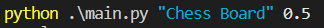

# personal_shopping_assistant_using_uagents
We are using this project to showcase how much we have learned about fetch.ai and how to use its functionlities.

The Assistant takes in the name of the product and the minimum rating required of the product and then it searches for the product on google store using rapid api and returns the link of the product with the minimum cost with the required rating.


All the further query results are added on the list.

# Working

you can start by first installing the dependencies by running the command
```
pip install -r requirements.txt
```

Also make the environment variable for the rapid api key from:

https://rapidapi.com/letscrape-6bRBa3QguO5/api/real-time-product-search/

use the .env.template file to create the .env file and add the key to it.

*if there are no products being fetched please hardcode the API key in the get_products.py [line 16].*

Then you can run the uagents project by running:

```
python main.py [Name of the product] [Rating filter]
```




